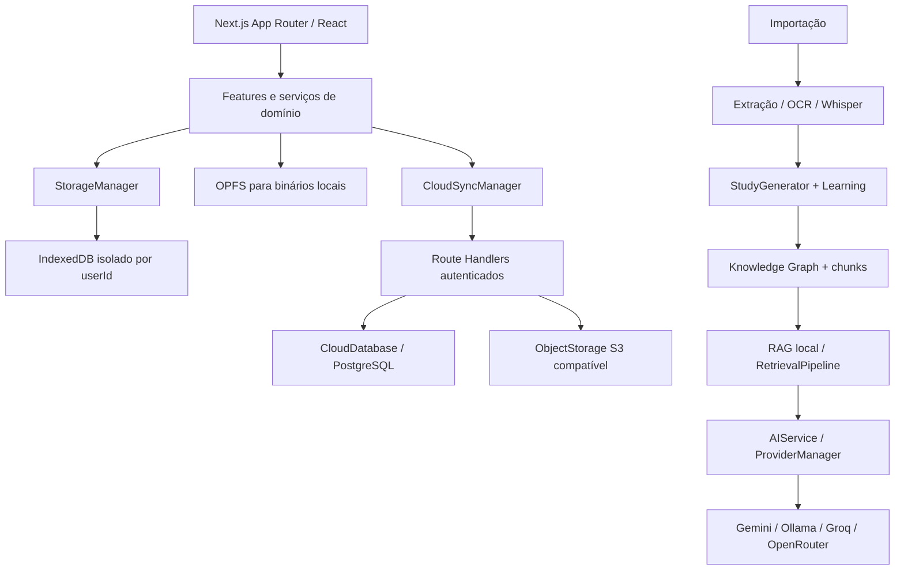

# Arquitetura, APIs e fluxos

## Visão de alto nível



Features de navegador não importam adapters server-only. Dados pesados permanecem locais para uso offline; sync transporta alterações incrementais e arquivos binários sob demanda.

## Importação e organização

```text
arquivo/pasta selecionado
  → validação de tipo, identidade e duplicata
  → OPFS e registro `documents`
  → extração nativa / OCR ou Whisper quando aplicável
  → normalização e `contents`
  → StudyGenerator cria/reusa Study e metadados
  → Knowledge Engine cria conceitos e relações
  → chunks semânticos e embeddings locais
  → Biblioteca, Dashboard, Search, Tutor e Mentor consomem stores oficiais
```

Se uma identidade já existir sem binário no OPFS, reimportar o original restaura o binário e reusa o id do registro. A deleção sincronizada remove também a cópia OPFS no dispositivo remoto.

## Tutor, Professor, Mentor e Skills

```text
pergunta/contexto de estudo
  → RetrievalPipeline consulta chunks e grafo locais
  → ContextBuilder/PromptBuilder limita histórico e contexto
  → AIService
  → ProviderManager (manual ou automático)
  → provider selecionado
  → resposta JSON ou NDJSON
  → Tutor/Skill persiste no IndexedDB
```

Arquivos físicos não são enviados ao provider. O contexto de estudo é montado a partir de registros já extraídos. Mentor combina evidências do Learning Engine e Knowledge Graph com o mesmo AI Core.

O modo Professor é uma especialização do Tutor, não um serviço de IA paralelo:

```text
nível + método + ação + trecho opcional
  → validação em /api/tutor
  → TeacherPromptBuilder
  → PromptBuilder / ContextBuilder
  → AIService / cache / ProviderManager
```

Ações amplas usam `RetrievalPipeline.forStudy`; perguntas e seleções usam recuperação direcionada. Learning Engine, capítulos, Knowledge Graph e continuidade do Mentor entram apenas como objetos estruturados. Consulte [AI_TEACHER.md](./AI_TEACHER.md).

## Cloud Sync e recuperação

```text
mudança no StorageManager
  → manifesto/hash/tombstone
  → fila local offline
  → POST /sync (mutations)
  → ConflictResolver por versão-base
  → GET /sync?since=cursor
  → aplica registro no banco da identidade atual
```

Binários usam endpoint autenticado `/api/files/[id]` e chaves com userId. A chave do Object Storage e as credenciais S3 só existem no servidor. `DELETE` propaga ao servidor e a outros dispositivos; o listener remoto remove IndexedDB, OPFS e manifesto local.

Backups salvam `sync_records`. Os bytes de S3/OPFS não fazem parte do snapshot. Para repor um binário excluído com um metadado restaurado, a pessoa precisa reimportar o original; a importação preserva o id por identidade. A retenção e a restauração de bytes no cloud permanecem pendentes.

## Modelo de persistência

| Store | Conteúdo-chave |
| --- | --- |
| `documents` | Metadados, identidade, status, localização e estudo dos materiais. |
| `contents` | Texto extraído, seções, metadados e logs. |
| `chunks` | Trechos recuperáveis e proveniência. |
| `embeddings` | Vetores locais associados a chunks. |
| `studies` | Tema, organização e progresso. |
| `notes`, `summaries`, `flashcards`, `quizzes` | Produções e revisões vinculadas ao estudo. |
| `transcriptions`, `ocr` | Saídas dos processadores de mídia. |
| `knowledge` | Grafo semântico por documento/estudo. |
| `metadata` | Migrações, conversas, preferências sincronizadas e estado versionado. |

`StorageManager` é a fronteira de acesso. A identidade troca o nome do banco IndexedDB; os dados de uma conta não são mesclados automaticamente aos dados de convidado.

## Endpoints

O inventário completo dos 27 handlers está em [INVENTARIO_PROJETO.md](./INVENTARIO_PROJETO.md). Contratos de maior impacto:

| Endpoint | Direção | Segurança/função |
| --- | --- | --- |
| `/api/tutor` | cliente → server → provider | ContextPackage; geração completa ou NDJSON. |
| `/api/ai/manager` | cliente → server | Health/cache/status; não transmite API keys. |
| `/sync` | cliente ↔ server | Push de deltas e pull por cursor; sessão/CSRF e versionamento. |
| `/api/files/[id]` | cliente ↔ server | PUT/GET/DELETE binário autenticado por userId e hash. |
| `/backup` | cliente ↔ server | Snapshots/restauração dos registros syncáveis. |
| `/api/health` | monitor → server | Health público mínimo e detalhes protegidos. |
| `/api/telemetry` | cliente → server | Métricas anônimas e allowlisted com consentimento. |

## Configuração operacional

Consulte [PRODUCTION.md](../PRODUCTION.md) para Docker Compose, Caddy, domínio, Postgres, S3/MinIO, secrets, backup e release. A infra local não foi executada nesta auditoria porque Docker não está instalado; o banco e o Object Storage reais devem ser testados em homologação.
